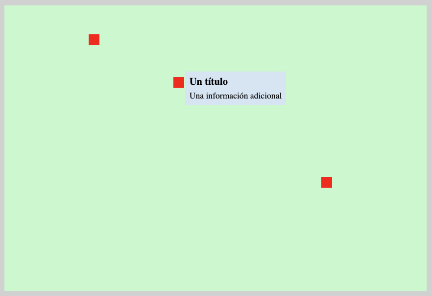

# PROYECTO Mapa

El proyecto consiste en una aplicación web que muestra un mapa (área rectangular) donde
se encuentran localizados una serie de puntos de interés (ítems) que revelan una leyenda informativa cuando se sobrevuela con el cursor sobre lo puntos.

La descripción es suficientemente general con idea de que pueda ser adaptada a distintos escenarios.
Un ejemplo, no vinculante, podría apoyarse en la siguiente asociación de conceptos:

- el mapa podría ser una imagen de una ciudad.
- los puntos de interés localizados en el mapa podrían ser los restaurantes de la ciudad
- las leyendas mostraría información particular sobre el restaurante como puede ser su nombre, comentario sobre el tipo de comida que ofrecer, horaria de apertura y cierre, etc.

Independientemente del contexto en el que se aplique, lo esencial es que el mapa mostrará en todo momento los puntos de interés mientras que la leyenda sólo se mostrará al sobrevolar el punto de interés.

El contenido del proyecto estará constituido por un fichero index.html con los elementos básicos acompañado de su correspondiente hoja de estilos (style.css) y
el guion (script.js) encargado de los aspectos interactivos y funcionales.

## Objetivos

El objetivo de esta actividad es el empleo del posicionamiento (position) y las transformaciones (transform) para
reubicar elementos en aquellos casos donde no es factible obtener un resultado visual similar apoyándose en flexbox y/o grid.

## Consideraciones

- El tamaño del mapa debe adaptarse al tamaño de la pantalla.
- Los puntos de interés deben adaptarse al tamaño del mapa.
- La leyenda será un contenedor que constará de titulo y descripción:
  ` 

  <h3>Título</h3>
  
Descripción

    
`

- Almacén de items: Los puntos de interés están recogidos en un almacén donde para cada ítem se recopila la información necesaria para su gestión dentro de la aplicación. Al iniciar la aplicación, y según el contenido del almacén,
  los ítems serán añadidos al DOM para ser visualizados en el mapa.
