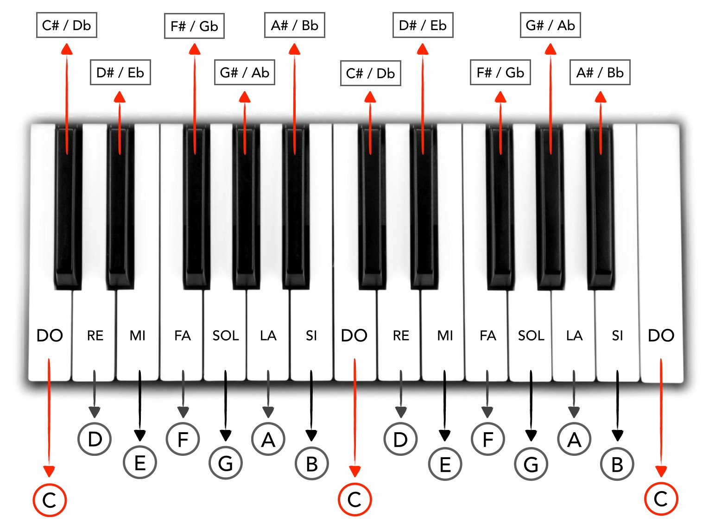

# PROYECTO Piano

El proyecto consiste en una aplicación web que muestra un piano (visión cenital) con el que usuario puede interaccionar para tocar las teclas.

Veamos algunos conceptos previos para entender lo que se pide.  

**Notas musicales**: Hay dos notaciones altenativas para nombrar las notas musicales: 
- Notación italiana: do, re, mi, fa, sol, la y si. 
- Notación germánica: C, D, E, F, G, A y B. E
Vemos que la notación germánica usa letras y que empieza por C (que equivale a do en la notación italiana). 

**Tono y Semitono**:  Entre dos notas comsecutivas hay una distancia en altura de un tono salvo de mi a fa y de si a do, que es de un semitono.

**Alteracioón**: Para identificar el semitono entre dos notas se añade a la nota una alteración: bemol (b) o sostenido (#).
El sostenido refleja una subida de un semitono mientras que el bemos refleja una bajada de semitono. Aunque existen una difernecia acústica, a efectos prácticos podemos considerar que ambas notaciones representan la misma nota.
Ejemplo: entre do y re hay un tono. El tono intermedio se denota como do# (do sostenido) o reb (re bemol). 

Considerando tonos y semitonos, las notas musicales serían las siguientes:

        do, do#/reb, re, re#/mib, mi, fa, fa#/solb, sol, sol#/lab, la, la#/lab, si

En un piano, tenemos que: 
- las notas blancas se corresponden con las 7 notas sin alteración: do, re, mi, fa, sol, la, si
- las notas negras se corresponden con las 5 notas alteradas: do#/reb, re#/mib, fa#/solb, sol#/lab, la#/lab
Esta es la razón de la disposción asimétrica de notas blancas y negras en un teclado de un piano. Siete frente a cinco.

En la imagen se muestra un teclado con los nombres de las teclas usando ambas notaciones.

**Escala**: es una secuencia de notas consecutivas. 
**Octava**: Es una escala (secuencia ocho notas consecutivas. Empezando desde do, la octava estaría formada por do, re, mi, fa, sol, la, si y do. 
Hay una diferencia acústica importante: el primer do es más grave que el segundo do. Es decir, la frecuencia asociada a la primera nota es menor que la de la segunda. Para hacer patente esta distinción, el nombre de la nota puede ser acompañada con un número de octava.  

**Altura** Existe un convenio sobre la frecuencia asociada a cada nota. En particular la nota la4 tiene asociada una frecuencia 440. 

Para poder consultar las frecuencias de las notas
  https://es.wikipedia.org/wiki/Frecuencias_de_afinaci%C3%B3n_del_piano

El contenido del proyecto estará constituido por un fichero index.html con los elementos básicos acompañado de su correspondiente hoja de estilos (style.css) y el guion (script.js) encargado de los aspectos interactivos y funcionales.

## Objetivos

El objetivo de esta actividad es el empleo de la Web Audio API para la generación de audio y el posicionamiento (position) y las transformaciones (transform) para reubicar elementos en aquellos casos donde no es factible obtener un resultado visual similar apoyándose en flexbox y/o grid.

## Consideraciones

- El tamaño del piano (y de las teclas) debe adaptarse al tamaño de la pantalla
- El piano debe abarcar una octava (de do4 a do5)
- Al pulsar una tecla (negra o blanca) se deberá:
 - reproducir la frecuencia asociada a la nota que se pulsa  
-  el sonido emitido será el generado por una de las cuatro formas de onda de un oscilador: sinusoidad, triangular, cuadrada y diente de sierra
- La apliación debe ofrecer un control para modificar la forma de onda

